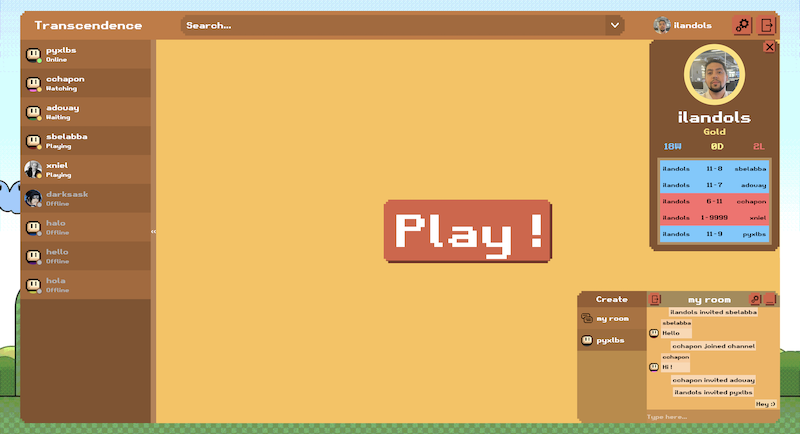
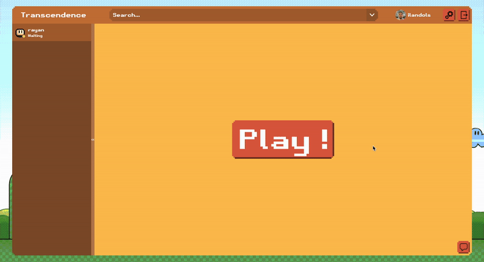
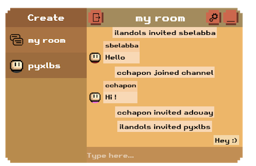
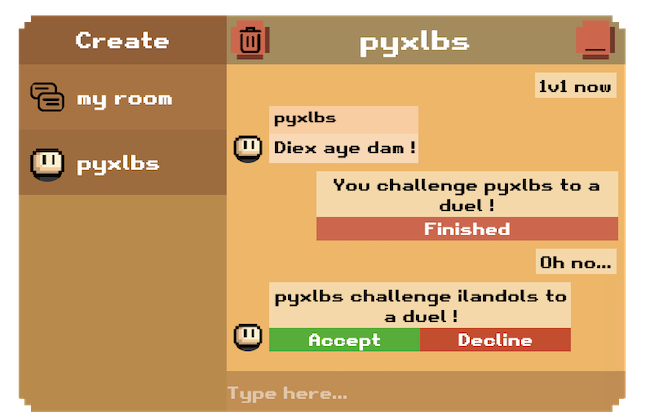
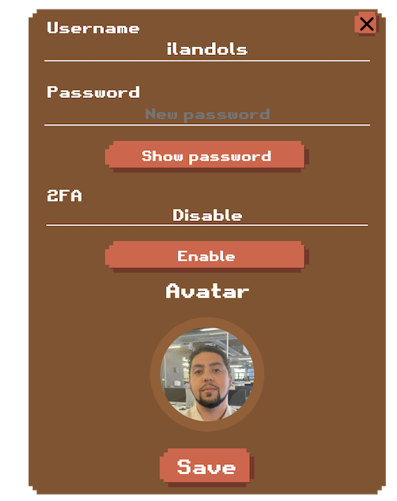

<div align="center">
	
</div>

<h1 align="center">
	Link
</h1>
<p align="center">
	https://transcendance.ilandols.com
</p>


## Description
<p align="center">
	Are you the best Pong player out there ? It's time to find out ! <br>
	This project has been completed in collaboration with <a href="https://github.com/Clachp" target="_blank">@Clachp</a>, <a href="https://github.com/Numedios" 		target="_blank">@Numedios</a> and <a href="https://github.com/AntoineDouay" target="_blank">@AntoineDouay</a>.
</p>


## Local installation

- Step 1 : Install and run Docker [Documentation](https://docs.docker.com/engine/install/)

- Step 2 : Clone the project and replace the two ".env-example" file extensions with ".env". You can find them located in the "front" and "back" folders. Variables are already filled, but it's recommended to replace them with your own values.

- Step 3 : On a terminal, go to the project folder and execute :
```bash
docker compose up --build
```

<p align="center">
	After building, your app will be running on the URL specified in the front .env file (localhost:4173 by default).
</p>
<div align="center">
	
</div>


# Features

## Pong
<div align="center">
	
</div>

<p align="center">
	After signing up and / or logging in, you'll be all set to play Pong, the famously timeless game from the 70's. You can either add friends to challenge them or play against random players using the matchmaking feature. The first one to reach 11 points wins the game !
</p>

## Chat
<div align="center">
	
	
</div>

<p align="center">
	Playing is fun, but playing AND chatting is even better, so join a room with your friends to start a conversation ! You can create your own public and private rooms, but also simply send direct messages for more privacy.
</p>

## Account
<div align="center">
	
</div>

<p align="center">
	After signing up, you'll be able update your data whenever you want. You can both enable and disable the double authentication, download the Google Authenticator app on your smartphone to do so.
</p>

## More
Are you a 42 student ? If so, you can sign up with your 42 account, as the app uses the OAuth 2.0 protocol to link your 42 account with this one !
